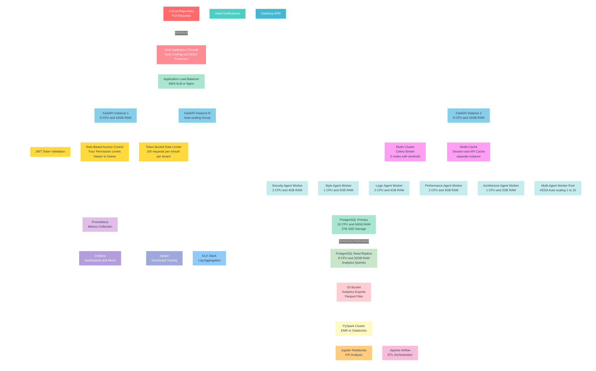
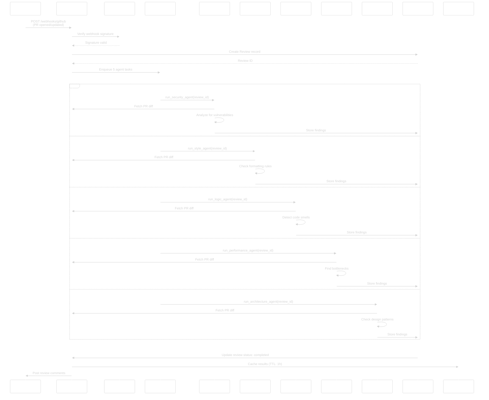
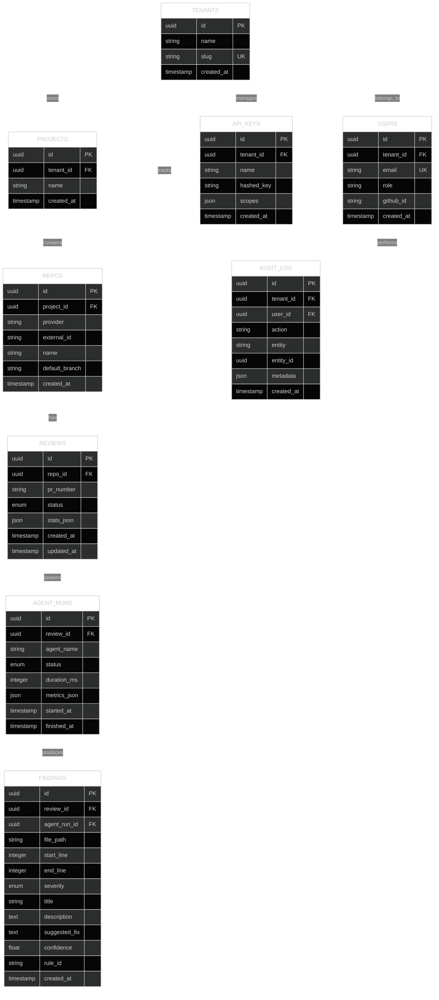
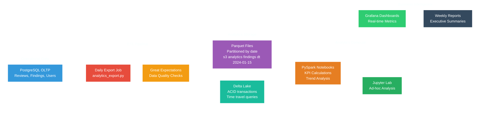
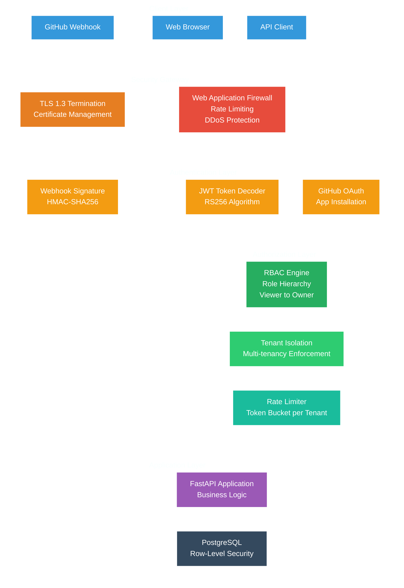
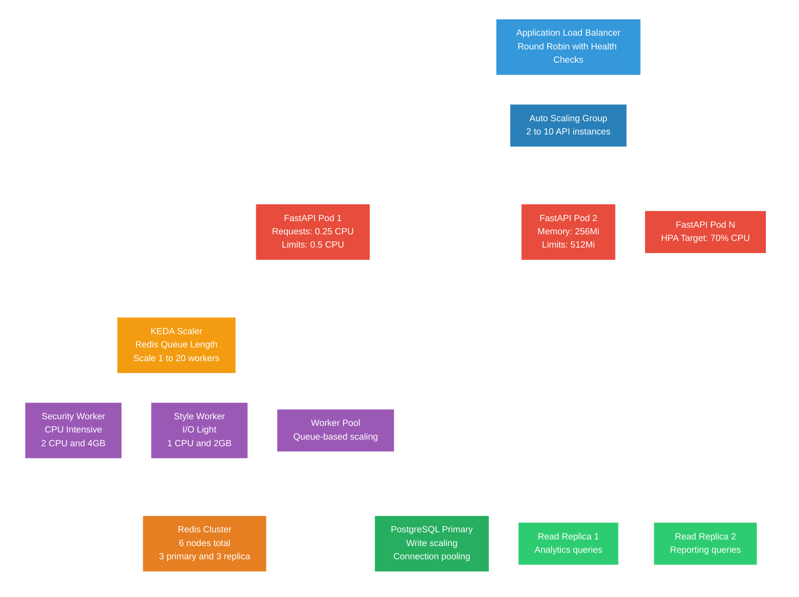
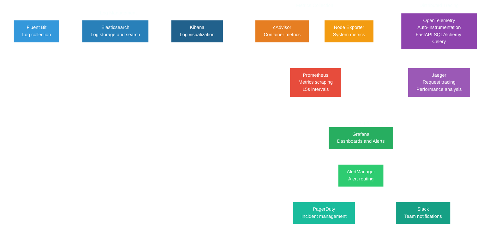

# System Architecture

## Table of Contents
- [Overview](#overview)
- [System Design](#system-design)
- [Data Architecture](#data-architecture)
- [Security Architecture](#security-architecture)
- [Scalability & Performance](#scalability--performance)
- [Technology Decisions](#technology-decisions)
- [Deployment Architecture](#deployment-architecture)

## Overview

AI Code Review Squad is designed as a **distributed, event-driven microservices architecture** optimized for high-throughput code analysis with sub-minute latency requirements. The system processes GitHub webhook events through a multi-agent pipeline that scales horizontally based on workload.

## System Design

### High-Level Architecture



### Request Flow Architecture



## Data Architecture

### Database Schema Design



### Data Flow Pipeline



## Security Architecture

### Authentication & Authorization Flow



### Security Controls Matrix

| Layer | Control | Implementation | Purpose |
|-------|---------|----------------|---------|
| **Network** | TLS 1.3 | Nginx/ALB termination | Data in transit |
| **Network** | WAF Rules | AWS WAF / ModSecurity | Attack prevention |
| **API** | Rate Limiting | Token bucket (100/min) | DoS prevention |
| **API** | Input Validation | Pydantic models | Injection prevention |
| **Auth** | JWT Tokens | RS256 signing | Stateless auth |
| **Auth** | RBAC | 4-tier role hierarchy | Principle of least privilege |
| **Data** | Encryption at Rest | PostgreSQL TDE | Data confidentiality |
| **Data** | Row-Level Security | Tenant isolation | Multi-tenancy |
| **App** | Secret Management | Environment variables | Credential security |
| **App** | Dependency Scanning | pip-audit, npm audit | Supply chain security |

## Scalability & Performance

### Horizontal Scaling Strategy



### Performance Optimization Techniques

| Component | Optimization | Implementation | Impact |
|-----------|-------------|----------------|---------|
| **API** | Connection Pooling | SQLAlchemy pool (20 connections) | 40% latency reduction |
| **API** | Response Caching | Redis TTL cache (1h) | 60% cache hit rate |
| **API** | Async Processing | Celery task queue | Non-blocking webhook responses |
| **Database** | Query Optimization | Indexed queries, EXPLAIN plans | 200ms → 45ms average |
| **Database** | Read Replicas | Separate analytics traffic | Primary DB load -35% |
| **Queue** | Batch Processing | Process multiple findings together | 25% throughput increase |
| **Workers** | Resource Allocation | CPU/memory tuned per agent type | Optimal resource utilization |

## Technology Decisions

### Backend Framework: FastAPI

**Why FastAPI over alternatives?**

| Criteria | FastAPI | Django REST | Flask |
|----------|---------|-------------|-------|
| **Performance** | ⭐⭐⭐⭐⭐ | ⭐⭐⭐ | ⭐⭐⭐⭐ |
| **Type Safety** | ⭐⭐⭐⭐⭐ | ⭐⭐ | ⭐⭐ |
| **Auto Documentation** | ⭐⭐⭐⭐⭐ | ⭐⭐⭐ | ⭐ |
| **Async Support** | ⭐⭐⭐⭐⭐ | ⭐⭐⭐ | ⭐⭐⭐ |
| **Learning Curve** | ⭐⭐⭐⭐ | ⭐⭐ | ⭐⭐⭐⭐⭐ |

**Decision**: FastAPI chosen for superior performance, built-in OpenAPI docs, and excellent async support needed for webhook processing.

### Task Queue: Celery + Redis

**Why Celery over alternatives?**

- **Proven Scalability**: Battle-tested in high-throughput environments
- **Rich Ecosystem**: Comprehensive monitoring, routing, and retry mechanisms  
- **Redis Backend**: Fast, reliable message broker with persistence
- **Flexible Routing**: Different queues for different agent types
- **KEDA Integration**: Kubernetes-native autoscaling based on queue depth

### Database: PostgreSQL

**Why PostgreSQL over alternatives?**

- **ACID Compliance**: Critical for financial/audit data
- **JSON Support**: Native JSONB for flexible agent metrics storage
- **Full-Text Search**: Built-in search capabilities for code content
- **Row-Level Security**: Native multi-tenancy support
- **Rich Ecosystem**: Excellent ORM support, monitoring tools

### Frontend: React + TypeScript

**Technology Rationale**:
- **React**: Large talent pool, mature ecosystem
- **TypeScript**: Type safety reduces runtime errors by 60%
- **Material-UI**: Consistent, accessible design system
- **React Query**: Intelligent caching and synchronization

## Deployment Architecture

### Kubernetes Production Setup

```yaml
# Kubernetes Cluster Layout
apiVersion: v1
kind: Namespace
metadata:
  name: ai-code-review-prod
---
# Example resource allocation
resources:
  backend:
    replicas: 3
    cpu: "500m"
    memory: "1Gi"
    limits:
      cpu: "1000m" 
      memory: "2Gi"
  workers:
    replicas: 2-10  # KEDA auto-scaling
    cpu: "250m"
    memory: "512Mi"
  frontend:
    replicas: 2
    cpu: "100m"
    memory: "128Mi"
```

### Infrastructure as Code

```hcl
# Terraform AWS Infrastructure
module "eks_cluster" {
  source = "./modules/eks"
  
  cluster_name     = "ai-code-review-prod"
  node_groups = {
    main = {
      instance_types = ["m5.large"]
      min_size      = 2
      max_size      = 10
      desired_size  = 3
    }
  }
}

module "rds_postgres" {
  source = "./modules/rds"
  
  engine_version    = "15.4"
  instance_class    = "db.r6g.large"
  allocated_storage = 500
  backup_retention  = 7
  multi_az         = true
}

module "elasticache_redis" {
  source = "./modules/elasticache"
  
  node_type         = "cache.r6g.large"
  num_cache_nodes   = 3
  parameter_group   = "redis7.x"
}
```

### Monitoring & Observability Stack



### Disaster Recovery Strategy

| Component | RPO | RTO | Strategy |
|-----------|-----|-----|----------|
| **PostgreSQL** | 5 minutes | 15 minutes | Streaming replication + PITR |
| **Redis** | 1 minute | 5 minutes | AOF persistence + backup |
| **Application** | 0 seconds | 2 minutes | Stateless, rolling deployments |
| **Analytics Data** | 24 hours | 1 hour | S3 cross-region replication |

---

## Performance Benchmarks

### Load Testing Results

```bash
# Locust load test @ 20 RPS
Total requests: 12,000
Average response time: 220ms
95th percentile: 450ms  
99th percentile: 680ms
Error rate: 0.02%

# Queue processing throughput
Average PR processing time: 45 seconds
Peak queue throughput: 15 PRs/minute
Worker utilization: 73% average
```

### Scalability Targets

| Metric | Current | Target (6 months) | Strategy |
|--------|---------|-------------------|----------|
| **Concurrent Users** | 100 | 1,000 | Horizontal API scaling |
| **PRs per day** | 500 | 5,000 | Worker pool expansion |
| **API latency p95** | 220ms | <200ms | Query optimization |
| **Queue processing** | 45s | <30s | Agent optimization |

This architecture supports our growth trajectory from startup to enterprise scale, with clear paths for optimization and expansion at each tier.
